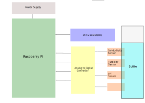

# Smart Bottle

A smart device (bottle) that helps the user decide whether the water in the bottle is fit for drinking in real time. The system consists of several electrochemical sensors interfaced to a Raspberry Pi through an Analog to Digitial converter. The designed algorithm collates the sensor data and produces an optimal result based on specified hard-coded strategy. The result is displayed on a 16 X 2 LCD device in a user friendly manner.

## Schematic Diagram

## Threshold Values 

| Parameter  | Units | Expected Range |
| ------------- | ------------- | ------------- |
| Conductivity  | µs/cm  | 500-1000  |
| Turbidity  | NTU | 0-5  |
| pH  | PH  | 6.5-8.5 |

## References
[1] World Health Organization Guidelines for drinking-water quality, fourth edition, 2011
